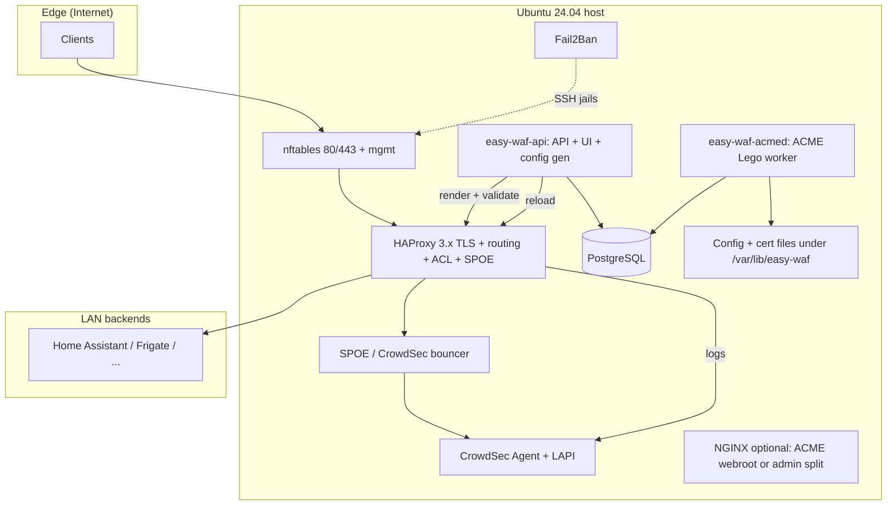
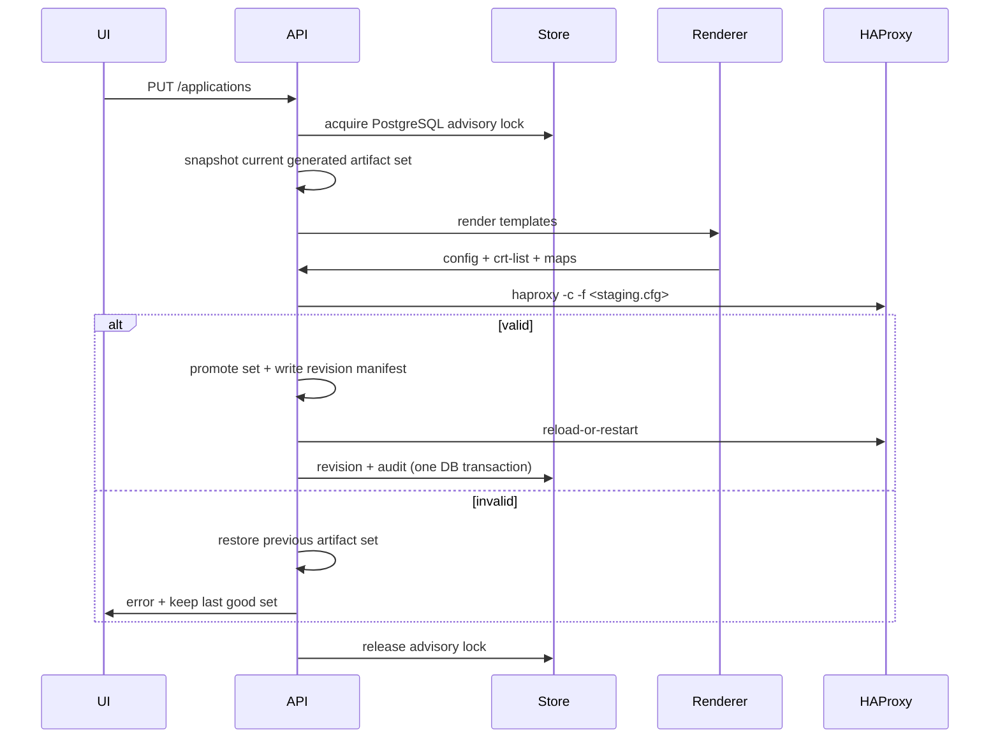

# Easy Home WAF — Architecture

**Document / product version:** aligned with root [`VERSION`](../VERSION) (**1.4.1**). Acceptance matrix **AC-01…AC-10:** [PROMPTS_ALIGNMENT.md](PROMPTS_ALIGNMENT.md) §9.

## Product / technical vision

**Easy Home WAF** is a single-purpose **secure publishing gateway** for homelab and smart-home users: one TLS entry (HAProxy), observable traffic, CrowdSec-backed decisions, local management UI, and ACME automation—without cloud control planes. The product optimizes for **predictable operations** (atomic config apply, rollback, audit) over feature breadth.

## Architecture variants (decision record)

| Variant | Pros | Cons | Fit |
|--------|------|------|-----|
| **A — Monolithic Go daemon** | Single binary, embedded UI | SQLite not suitable for HA / SME growth | Superseded |
| **B — Python FastAPI UI + Go/native worker** | Rich API ecosystem | Two runtimes | Optional future |
| **C — Split services + shared DB** | **PostgreSQL** (MariaDB-compatible path later), independent **API** vs **ACME worker**, SME-friendly HA story | More moving parts | **Chosen** |

## High-level architecture

## Reference topology: NGFW → WAF → web backends

A common homelab/SMB pattern uses a **network firewall / NGFW** (e.g. **MikroTik RouterOS**, **FortiGate 60E-class**) on the Internet edge and a **dedicated WAF host** behind it:

1. **Internet** clients hit the **WAN** of the NGFW (often **80/tcp** and **443/tcp**).
2. The NGFW applies **destination NAT / virtual IP / port forwarding** to the **WAF appliance** on the internal network (same ports or different — both sides are configurable).
3. **Easy Home WAF** (HAProxy on the appliance) terminates TLS at the edge, applies host routing, CrowdSec SPOE, IPBL/maps, and forwards to **web** backends (Home Assistant, Synology DSM/UI, 3CX Web, Frigate, Nextcloud, etc.).
4. **Management** (API/UI: **HTTPS 8443** by default; cleartext HTTP off unless loopback or `EASY_WAF_ALLOW_INSECURE_HTTP=1`) should **not** be forwarded from the WAN; use LAN, VPN, or SSH port-forward — align with `EASY_WAF_LISTEN_HTTP` / `EASY_WAF_LISTEN_HTTPS`, `management_allowed_cidrs`, and **nftables** (see `/etc/nftables/easy-waf.nft`).

**Typical TLS/HTTP modes** (all first-class web traffic in this product):

| Client → WAF | WAF → backend | Notes |
|--------------|---------------|--------|
| HTTP | HTTP | Lab or behind external TLS terminator; redirect to HTTPS on WAF when possible. |
| HTTPS | HTTP | Common: TLS only at WAF; backend plain HTTP on LAN. |
| HTTPS | HTTPS | `BackendHTTPS` + TLS verify (`required` with Ubuntu CA by default; `none` is an explicit legacy override). |
| HTTP | HTTPS | Rare; useful only when something upstream forces HTTP to the WAF. |

**Ports** on the NGFW public side and on the WAF **frontend** bind can differ from **backend** `host:port` (e.g. public 443 → WAF 443 → app **8123**). HAProxy maps **Host** (and TLS SNI) to the correct backend; DNAT only needs to reach the WAF listener.

**On the NGFW (recommended)**:

- Enable **IPS** (and tune signatures / false-positive handling for home use).
- Enable **Application Control** / firewall **application rules** where the platform supports it, so policy is not “only port 443” but aligned with expected web traffic.
- Keep **GeoIP / reputation** and **botnet** feeds if licensed and maintained.
- Log and correlate with CrowdSec decisions on the WAF where useful.

The WAF remains responsible for **per-hostname routing**, **ACME**, **CrowdSec SPOE**, and **IPBL**; the NGFW remains responsible for **edge policy**, **VPN**, and **segmentation** to the WAF DMZ/LAN.

## Data flow (request)

1. HAProxy terminates TLS for HTTPS applications; SNI / Host routes HTTP or HTTPS to the backend.
2. SPOE asks CrowdSec bouncer for decision (engine name aligned with SPOE file).
3. A reusable per-application block enforces IP lists, GeoIP, bot/User-Agent checks, optional **basic WAF** regex ACLs, methods, paths, restricted paths, and CrowdSec on every enabled HTTP/HTTPS frontend. Backend rate limiting runs once per request.
4. HAProxy logs to files/socket; CrowdSec parses; decisions feed bouncer.
5. `easy-waf-api` exposes stats/API; state lives in **PostgreSQL**; **IPBL** map file is regenerated from DB + optional external lists, and **IPWL** allowlist map from `ipwl_local`, before each HAProxy render.

## Configuration model

- **Source of truth**: PostgreSQL tables (`applications` including JSONB `restricted_paths` for LAN-only URL prefixes, `certificates`, `settings`, `audit_log`, `config_revisions`, `ipwl_local`, `ipbl_local`, `ipbl_external_sources`) + export bundles for backup.
- **Generated artifacts**: `haproxy.cfg`, `crt-list.txt`, `ip_blacklist.map` (from local + synced external IPBL), `ip_allowlist.map` (from `ipwl_local` when enabled), blocked User-Agent and global/per-app GeoIP maps.
- **Artifact revisions**: each successful apply stores a checksum-verified manifest and private copies of the complete generated set under `revisions/artifacts-*/`. The legacy `haproxy-<sha12>.cfg` copy remains for UI previews and rollback compatibility with revisions created before artifact manifests.
- **Profiles** (`balanced`, `strict`, `trusted-lan`, `public-app`, `home-assistant`): declarative structs in Go → template variables (rate limits, paths, timeouts, WebSocket flags).

## Directory layout (on appliance)

| Path | Purpose |
|------|---------|
| `/etc/easy-waf/` | Environment, defaults, optional overrides |
| `/var/lib/easy-waf/` | Generated configs, cert storage, revisions (DB is PostgreSQL, not here) |
| `/var/log/easy-waf/` | Daemon and apply logs |

## systemd layout

| Unit | Role |
|------|------|
| `easy-waf-hostd.service` | Root privilege broker — unix socket `/run/easy-waf/hostd.sock` (`root:easy-waf` **0660**); host/netplan/nft/systemd/apt/users/journal/power |
| `easy-waf-api.service` (alias `easy-wafd.service` may point to same binary) | API, UI, config apply (unprivileged; talks to hostd) |
| `easy-waf-acmed.service` | ACME issuance/renewal (Lego HTTP-01), then triggers config reload via DB + optional apply |
| `haproxy.service` | Stock; reload triggered after successful apply |
| `crowdsec.service` | Stock |
| `fail2ban.service` | Stock |

## Security model

- Dedicated user `easy-waf` (least privilege); `haproxy` remains isolated. Host mutations go through **`easy-waf-hostd`** (root), not `sudo` from the API process.
- Secrets in `/etc/easy-waf/secrets/` with `0600`. HAProxy reads generated configs via group **`easy-waf`** (AppArmor stock profile on Ubuntu).
- UI: session JWT (HS256) transmitted exclusively via `Authorization: Bearer` header (stored in browser `sessionStorage`, never in cookies). Because the token is not sent automatically by the browser on cross-origin requests, classical CSRF attacks do not apply. As defense-in-depth, the API validates a custom `X-Requested-With` header on all state-changing requests (see [SECURITY.md](SECURITY.md)). Default bind **all interfaces** on **8443** with **nftables** + **`management_allowed_cidrs`** (RFC1918 + loopback) in `easy-waf-api` for all routes except `/health` (see `internal/api/mgmtacl.go`).
- Subprocess: no shell; explicit argv; timeouts.
- Audit: append-only audit log for admin actions.

## TLS, SNI, and per-application certificates (one public IP)

Homelab setups usually expose **one WAN IP** to many **DNS names** (Home Assistant, Synology, VoIP web UI, etc.). The product matches that model:

| Mechanism | Role |
|-----------|------|
| **Single listener** | `bind *:443 ssl crt-list <path>` — one socket on the appliance; see `internal/haproxy/render.go`. |
| **crt-list** | Generated file lists **one PEM bundle per line** (full chain + key). Each enabled application contributes its certificate’s `bundle_path` (deduplicated if several apps share the same file). |
| **SNI** | HAProxy picks the **TLS certificate** whose CN/SAN matches the client’s **Server Name Indication** during the handshake — multiple certs on the same IP and port. |
| **HTTP `Host`** | After TLS, the frontend routes by `hdr(host)` to `public_host` → backend. **SNI hostname and `Host` should match** the published FQDN for that app. `public_host` must be **lowercase** and may not contain **`_`**: HAProxy matches with `hdr(host) -i`, so two rows differing only in case both match the same request and one application's allow rule short-circuits the other's denies; and `_` collides with the `.`→`_` mapping used to derive backend and ACL names. Neither character is legal in a DNS hostname. |
| **Per app** | Each `applications` row has `certificate_id` → `certificates` row (paths, ACME mode, SAN list in DB for UX; the PEM itself is authoritative for SNI). |
| **ACME** | Certificates can be **HTTP-01** or **DNS-01** via `easy-waf-acmed` (auto issue/renew to paths under state dir). |
| **Manual / user PEM** | Upload or install PEM paths on disk (`bundle_path`, or `fullchain_path` + `pem_key_path` with bundle created on apply) — suitable for corporate CAs or self-signed. |

Operational note: if a hostname is routed to an app but **no matching PEM** is in the crt-list (missing bundle or wrong `certificate_id`), the client may see the **wrong** default cert or a browser warning — keep each public hostname covered by a cert whose SAN includes that name.

**HTTP-only publishing:** each application has `listen_mode` (`https_only` by default). With **`http_only`**, the hostname is matched on **`fe_http` (:80)** and routed to the backend **without** a `fe_https` stanza for that app — useful for LAN-only or TLS-incapable clients. **`http_and_https`** serves the same host on both :80 (plain) and :443 (TLS) without forcing an HTTP→HTTPS redirect. When **no** application needs TLS, the engine may omit the :443 listener and ship an **empty crt-list** (ACME challenges still work on :80). See `internal/haproxy/render.go` and `docs/APPLICATION_SECURITY.md`.

## Certificate lifecycle

1. User creates a **certificate** record (ACME HTTP-01 / DNS-01, or manual paths) and links it from each **application** via `certificate_id`.
2. ACME client (Lego) obtains or renews cert → PEM bundle written to HAProxy-ready paths.
3. The complete generated artifact set is staged/snapshotted; `haproxy -c` runs before reload. Reload and revision/audit bookkeeping succeed together, or the previous files are restored.
4. Renewal scheduler in `easy-waf-acmed` (periodic tick); staging toggle per CA account.

## Config generation / apply flow

`easy-waf-api` and `easy-waf-acmed` share the advisory lock, so only one process
can promote or roll back HAProxy artifacts at a time. New rollback revisions
restore the manifest as a set; cfg-only historical rows use the legacy fallback.

## Log and metrics flow

- HAProxy → file → CrowdSec acquisition (user enables path in CrowdSec config; we ship samples).
- **Runtime metrics:** generated `haproxy.cfg` includes a **stats Unix socket** (`stats socket … mode 660 level admin`, `stats timeout 30s`). The default path is **`/run/haproxy/easy-waf-admin.sock`**; override via settings **`haproxy_stats_socket_path`** (`internal/config/types.go`). `easy-waf-api` reads **`show stat`** CSV over that socket (cached ~5s) and exposes **`GET /api/v1/stats/haproxy`** and **`GET /api/v1/stats/summary`** (`internal/metrics`, `internal/api/stats_handlers.go`). The Dashboard polls summary + detail every **10s** while the Dashboard tab is open. The **`easy-waf`** user typically needs membership in the **`haproxy`** group so it can open the socket created by the HAProxy service.
- Optional future: HAProxy Prometheus exporter or persistence of aggregates to PostgreSQL / TSDB for SME dashboards.

## Local UI flow

- Browser → management HTTPS. `install.sh` defaults to `0.0.0.0:8443` for LAN access; `install-interactive.sh` defaults to HTTPS-only `127.0.0.1:8443` for SSH port-forwarding. Cleartext management HTTP is an explicit legacy option, not a default.
- Static assets embedded in binary; API under `/api/v1`.

## Update / backup / restore

- `backup.sh`: one **`.tar.gz`** (format v1) — `pg_dump -Fc` → `easywaf.dump`, plus `state/` (`/var/lib/easy-waf`) and `etc/` (`/etc/easy-waf`). See [BACKUP_RESTORE.md](BACKUP_RESTORE.md).
- `restore.sh`: extract → `pg_restore` → restore state + `/etc/easy-waf` → start services → optional **`POST /api/v1/apply`**.
- `upgrade.sh`: replace binary + run migrations + reload daemon only.

## GeoIP architecture

- **Provider interface**: `GeoProvider` (`Lookup(ctx, ip) → ISO 3166-1 alpha-2`).
- **MVP provider**: **ipinfo.io** (`internal/geoip/ipinfo.go`) — `https://ipinfo.io/{ip}/json`, optional `GEOIP_IPINFO_TOKEN` query param, outbound **~1 req/s** (`MinInterval`). Tests may set `BaseURL` to an `httptest` server.
- **Cache**: in-memory **LRU + TTL** (`internal/geoip/cache.go`); stats: hits, misses, size — exposed at **`GET /api/v1/geoip/stats`**.
- **API**: **`GET /api/v1/geoip/lookup?ip=`** → `{ ip, country, cached }` for diagnostics (uses current `geoip_provider` / cache).
- **Settings** (global JSON / migration `007`): `geoip_enabled`, `geoip_provider` (`ipinfo`|`maxmind`), `geoip_default_policy` (`allow` = allow-list, `deny` = deny-list), `geoip_country_list` (alpha-2 codes), `geoip_enforce_map_path` (optional override).
- **HAProxy (batch MVP)**: on **Apply** / IPBL **Sync**, when `geoip_enabled`, each blacklist CIDR’s **network address** is resolved once → `geoip_enforce.map` lists CIDRs to **deny** (subset matching policy vs country list). The generated rule is included on every enabled application frontend. This is not a real-time lookup per connection (cf. CrowdSec); maps refresh on sync/apply.
- **MaxMind**: GeoLite2 Country **MMDB** is supported by the same provider interface and can be hot-reloaded with `POST /api/v1/geoip/reload` after replacing the file.

## Risks and contentious areas

| Risk | Mitigation |
|------|------------|
| SPOE syntax fragility | Golden tests; `haproxy -c`; version-pinned examples |
| CrowdSec package drift | Health checks only; document version matrix; optional pin file |
| HAProxy connect to backends | Unix groups + file permissions; AppArmor stock profile |
| Lego DNS provider credentials | File permissions + optional secret dir outside VCS |
| PostgreSQL HA | Use managed PG, Patroni, or cloud RDS for SME clusters |

## Implementation iterations (roadmap)

1. **Foundation**: models, PostgreSQL, HAProxy render + validate + apply + rollback.
2. **ACME**: Lego HTTP-01 + one DNS provider stub + renewal loop.
3. **Security**: profiles, path ACLs, stick tables, map files for trusted IPs.
4. **Integrations**: CrowdSec/LAPI probes, SPOE template, Fail2Ban status parser.
5. **Observability**: stats aggregation, certificate dashboard.
6. **UX**: wizard flow, backup/restore hardening, diagnostics bundle.

## Stack (MVP)

| Layer | Choice |
|-------|--------|
| Control plane | `easy-waf-api`: Go 1.22+, Chi, embedded `web/dist` |
| Host broker | `easy-waf-hostd`: root unix-socket broker (`internal/hostd`); long ops (e.g. `apt-upgrade-stream`) return **NDJSON** lines on the same socket instead of one JSON blob |
| ACME worker | `easy-waf-acmed` — Lego v4 HTTP-01 (webroot) |
| State | PostgreSQL (`pgx` / `database/sql`) |
| Templates | `text/template` for HAProxy / SPOE |
| UI | Static HTML embedded (`internal/webui/dist`); global settings edited per tab (**Certificates** = ACME + management TLS, **CrowdSec** = LAPI/SPOE, **Security** = WAF/GeoIP/lists); **Settings** = load-all from API |

NGINX remains **optional** in MVP for ACME webroot split or admin-only reverse proxy; primary edge is HAProxy per product definition.
