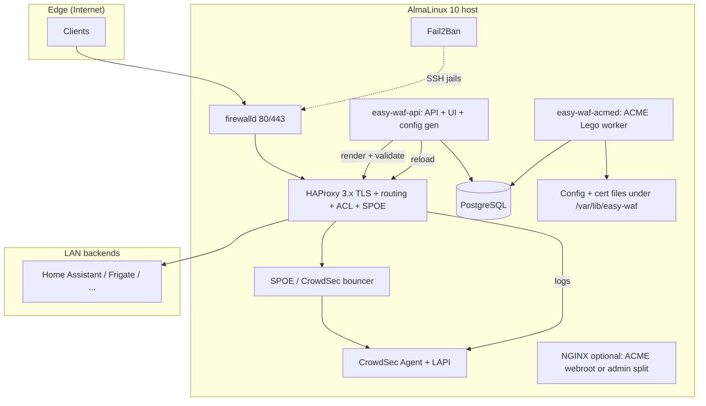
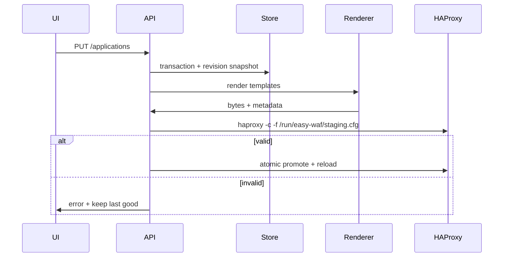

# Easy Home WAF — Architecture

## Product / technical vision

**Easy Home WAF** is a single-purpose **secure publishing gateway** for homelab and smart-home users: one TLS entry (HAProxy), observable traffic, CrowdSec-backed decisions, local management UI, and ACME automation—without cloud control planes. The product optimizes for **predictable operations** (atomic config apply, rollback, audit) over feature breadth.

## Architecture variants (decision record)

| Variant | Pros | Cons | Fit |
|--------|------|------|-----|
| **A — Monolithic Go daemon** | Single binary, embedded UI | SQLite not suitable for HA / SME growth | Superseded |
| **B — Python FastAPI UI + Go/native worker** | Rich API ecosystem | Two runtimes | Optional future |
| **C — Split services + shared DB** | **PostgreSQL** (MariaDB-compatible path later), independent **API** vs **ACME worker**, SME-friendly HA story | More moving parts | **Chosen** |

## High-level architecture

## Reference topology: NGFW → WAF → web backends

A common homelab/SMB pattern uses a **network firewall / NGFW** (e.g. **MikroTik RouterOS**, **FortiGate 60E-class**) on the Internet edge and a **dedicated WAF host** behind it:

1. **Internet** clients hit the **WAN** of the NGFW (often **80/tcp** and **443/tcp**).
2. The NGFW applies **destination NAT / virtual IP / port forwarding** to the **WAF appliance** on the internal network (same ports or different — both sides are configurable).
3. **Easy Home WAF** (HAProxy on the appliance) terminates TLS at the edge, applies host routing, CrowdSec SPOE, IPBL/maps, and forwards to **web** backends (Home Assistant, Synology DSM/UI, 3CX Web, Frigate, Nextcloud, etc.).
4. **Management** (API/UI: **HTTP 8000**, **HTTPS 8443**) should **not** be forwarded from the WAN; use LAN, VPN, or SSH port-forward — align with `EASY_WAF_LISTEN_HTTP` / `EASY_WAF_LISTEN_HTTPS`, `management_allowed_cidrs`, and firewalld.

**Typical TLS/HTTP modes** (all first-class web traffic in this product):

| Client → WAF | WAF → backend | Notes |
|--------------|---------------|--------|
| HTTP | HTTP | Lab or behind external TLS terminator; redirect to HTTPS on WAF when possible. |
| HTTPS | HTTP | Common: TLS only at WAF; backend plain HTTP on LAN. |
| HTTPS | HTTPS | `BackendHTTPS` + verify policy (e.g. `verify none` on trusted LAN). |
| HTTP | HTTPS | Rare; useful only when something upstream forces HTTP to the WAF. |

**Ports** on the NGFW public side and on the WAF **frontend** bind can differ from **backend** `host:port` (e.g. public 443 → WAF 443 → app **8123**). HAProxy maps **Host** (and TLS SNI) to the correct backend; DNAT only needs to reach the WAF listener.

**On the NGFW (recommended)**:

- Enable **IPS** (and tune signatures / false-positive handling for home use).
- Enable **Application Control** / firewall **application rules** where the platform supports it, so policy is not “only port 443” but aligned with expected web traffic.
- Keep **GeoIP / reputation** and **botnet** feeds if licensed and maintained.
- Log and correlate with CrowdSec decisions on the WAF where useful.

The WAF remains responsible for **per-hostname routing**, **ACME**, **CrowdSec SPOE**, and **IPBL**; the NGFW remains responsible for **edge policy**, **VPN**, and **segmentation** to the WAF DMZ/LAN.

## Data flow (request)

1. TLS terminates on HAProxy; SNI / Host routes to backend.
2. SPOE asks CrowdSec bouncer for decision (engine name aligned with SPOE file).
3. ACLs enforce rate limits, path blocks, geo (via stick-table / maps populated by `easy-wafd` or Lua-less patterns—MVP uses ACL + external map files refreshed periodically).
4. HAProxy logs to files/socket; CrowdSec parses; decisions feed bouncer.
5. `easy-waf-api` exposes stats/API; state lives in **PostgreSQL**; **IPBL** map file is regenerated from DB + optional external lists before each HAProxy render.

## Configuration model

- **Source of truth**: PostgreSQL tables (`applications`, `certificates`, `settings`, `audit_log`, `config_revisions`, `ipbl_local`, `ipbl_external_sources`) + export bundles for backup.
- **Generated artifacts**: `haproxy.cfg`, `crt-list.txt`, `ip_blacklist.map` (from local + synced external IPBL), optional `crowdsec-spoe.cfg` fragments.
- **Profiles** (`balanced`, `strict`, `trusted-lan`, `public-app`, `home-assistant`): declarative structs in Go → template variables (rate limits, paths, timeouts, WebSocket flags).

## Directory layout (on appliance)

| Path | Purpose |
|------|---------|
| `/etc/easy-waf/` | Environment, defaults, optional overrides |
| `/var/lib/easy-waf/` | Generated configs, cert storage, revisions (DB is PostgreSQL, not here) |
| `/var/log/easy-waf/` | Daemon and apply logs |

## systemd layout

| Unit | Role |
|------|------|
| `easy-waf-api.service` (alias `easy-wafd.service` may point to same binary) | API, UI, config apply |
| `easy-waf-acmed.service` | ACME issuance/renewal (Lego HTTP-01), then triggers config reload via DB + optional apply |
| `haproxy.service` | Stock; reload triggered after successful apply |
| `crowdsec.service` | Stock |
| `fail2ban.service` | Stock |

## Security model

- Dedicated user `easy-waf` (least privilege); `haproxy` remains isolated.
- Secrets in `/etc/easy-waf/secrets/` with `0600` and SELinux file contexts (documented in Security Guide).
- UI: session auth + CSRF for state-changing routes; default bind **all interfaces** on **8443** with **firewalld** + **`management_allowed_cidrs`** (RFC1918 + loopback) in `easy-waf-api` for all routes except `/health` (see `internal/api/mgmtacl.go`).
- Subprocess: no shell; explicit argv; timeouts.
- Audit: append-only audit log for admin actions.

## TLS, SNI, and per-application certificates (one public IP)

Homelab setups usually expose **one WAN IP** to many **DNS names** (Home Assistant, Synology, VoIP web UI, etc.). The product matches that model:

| Mechanism | Role |
|-----------|------|
| **Single listener** | `bind *:443 ssl crt-list <path>` — one socket on the appliance; see `internal/haproxy/render.go`. |
| **crt-list** | Generated file lists **one PEM bundle per line** (full chain + key). Each enabled application contributes its certificate’s `bundle_path` (deduplicated if several apps share the same file). |
| **SNI** | HAProxy picks the **TLS certificate** whose CN/SAN matches the client’s **Server Name Indication** during the handshake — multiple certs on the same IP and port. |
| **HTTP `Host`** | After TLS, the frontend routes by `hdr(host)` to `public_host` → backend. **SNI hostname and `Host` should match** the published FQDN for that app. |
| **Per app** | Each `applications` row has `certificate_id` → `certificates` row (paths, ACME mode, SAN list in DB for UX; the PEM itself is authoritative for SNI). |
| **ACME** | Certificates can be **HTTP-01** or **DNS-01** via `easy-waf-acmed` (auto issue/renew to paths under state dir). |
| **Manual / user PEM** | Upload or install PEM paths on disk (`bundle_path`, or `fullchain_path` + `pem_key_path` with bundle created on apply) — suitable for corporate CAs or self-signed. |

Operational note: if a hostname is routed to an app but **no matching PEM** is in the crt-list (missing bundle or wrong `certificate_id`), the client may see the **wrong** default cert or a browser warning — keep each public hostname covered by a cert whose SAN includes that name.

## Certificate lifecycle

1. User creates a **certificate** record (ACME HTTP-01 / DNS-01, or manual paths) and links it from each **application** via `certificate_id`.
2. ACME client (Lego) obtains or renews cert → PEM bundle written to HAProxy-ready paths.
3. Revision saved; `haproxy -c`; reload on success; failure keeps previous revision active.
4. Renewal scheduler in `easy-waf-acmed` (periodic tick); staging toggle per CA account.

## Config generation / apply flow

## Log and metrics flow

- HAProxy → file → CrowdSec acquisition (user enables path in CrowdSec config; we ship samples).
- Metrics: HAProxy Prometheus exporter (optional) or stats socket polling by `easy-waf-api` → aggregates can be stored in PostgreSQL or a time-series DB for SME dashboards.

## Local UI flow

- Browser → `https://<appliance-lan>:8443` or HTTP on LAN (default policy in settings).
- Static assets embedded in binary; API under `/api/v1`.

## Update / backup / restore

- `backup.sh`: `pg_dump` + `/var/lib/easy-waf` + `/etc/easy-waf`.
- `restore.sh`: validate bundle → import → render dry-run → apply.
- `upgrade.sh`: replace binary + run migrations + reload daemon only.

## GeoIP architecture

- **Provider interface**: `GeoProvider` (lookup IP → country).
- **MVP**: ipinfo.io token optional; **LRU + TTL cache** in memory; batch refresh for seen IPs; never per-request without cache hit.
- **Future**: MaxMind GeoLite2 local mmdb with same interface.

## Risks and contentious areas

| Risk | Mitigation |
|------|------------|
| SPOE syntax fragility | Golden tests; `haproxy -c`; version-pinned examples |
| CrowdSec package drift | Health checks only; document version matrix; optional pin file |
| SELinux booleans for HAProxy connect | Document `http_connect`, `network_connect` as needed |
| Lego DNS provider credentials | File permissions + optional secret dir outside VCS |
| PostgreSQL HA | Use managed PG, Patroni, or cloud RDS for SME clusters |

## Implementation iterations (roadmap)

1. **Foundation**: models, PostgreSQL, HAProxy render + validate + apply + rollback.
2. **ACME**: Lego HTTP-01 + one DNS provider stub + renewal loop.
3. **Security**: profiles, path ACLs, stick tables, map files for trusted IPs.
4. **Integrations**: CrowdSec/LAPI probes, SPOE template, Fail2Ban status parser.
5. **Observability**: stats aggregation, certificate dashboard.
6. **UX**: wizard flow, backup/restore hardening, diagnostics bundle.

## Stack (MVP)

| Layer | Choice |
|-------|--------|
| Control plane | `easy-waf-api`: Go 1.22+, Chi, embedded `web/dist` |
| ACME worker | `easy-waf-acmed` — Lego v4 HTTP-01 (webroot) |
| State | PostgreSQL (`pgx` / `database/sql`) |
| Templates | `text/template` for HAProxy / SPOE |
| UI | Static SPA (vanilla or Vite build) embedded |

NGINX remains **optional** in MVP for ACME webroot split or admin-only reverse proxy; primary edge is HAProxy per product definition.
